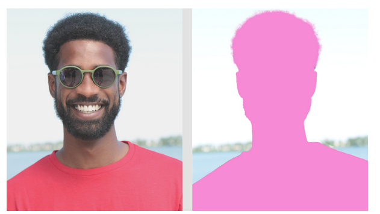
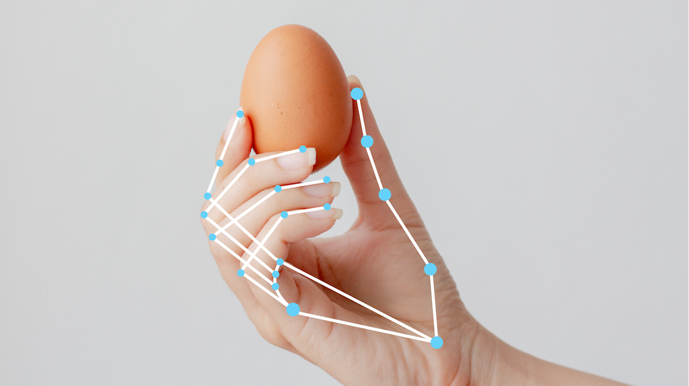

# Idée de plan

[Samia] Introduction 

### I. [Samia] Parler du dataset : 
  * données: complètes ou pas, cb d'instances, classes balancées ou pas,  si pas assez d'instances, est-ce qu'on peut en créer en appliquant des modifs aux images, visu de données
  * images: quel type d'images, taille, couleur ou N&B (il faudra mettre les images à la mm taille, les passer en noir et blanc)

  * ajouter nos propres images de webcam à l'entrainement et pour les tests

### II. [Héléna et Chaimaa] traitement sur les images/extraction des caractéristiques (forme, vecteur, contour, ... qu'est-ce qui est le plus pertinent):
  * les mettre à la mm taille, passer en noir et blanc, d'autres opérations sur les pixels (filtres?)
  * segmentation
  
  
  
  * détecter les pts de repères sur la main (cf mediapipe: https://ai.google.dev/edge/mediapipe/solutions/vision/hand_landmarker?hl=fr)
  
  

### III. [Chaimaa] modèles de ML de classification, qu'est-ce qui est le plus efficace (et rapide) sur ces données (SVM, KNN, Random Forest, gradient boosting, logistic reg... ) par ensemble (boosting et cie)?

### V. [Héléna] interface graphique, rendu final : 
  * affichage général (maquette?)
  * prise de photo (webcam de l'ordinateur)
  * exercices aléatoires
  
